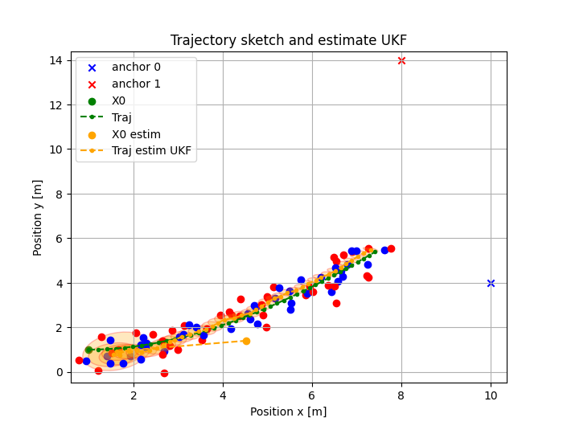
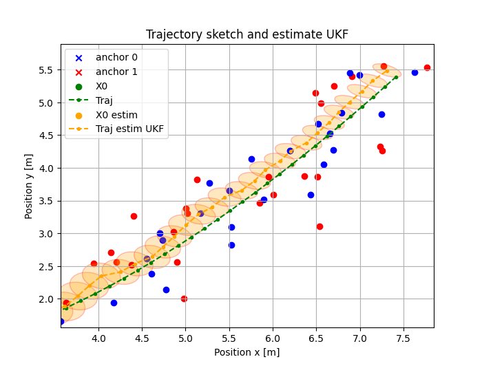
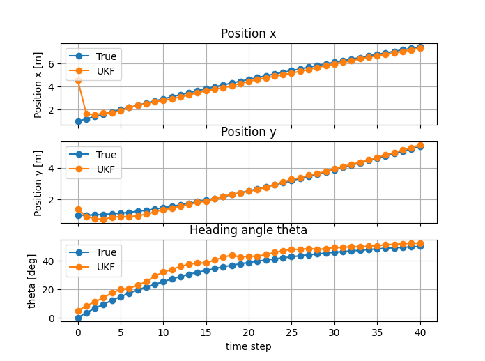
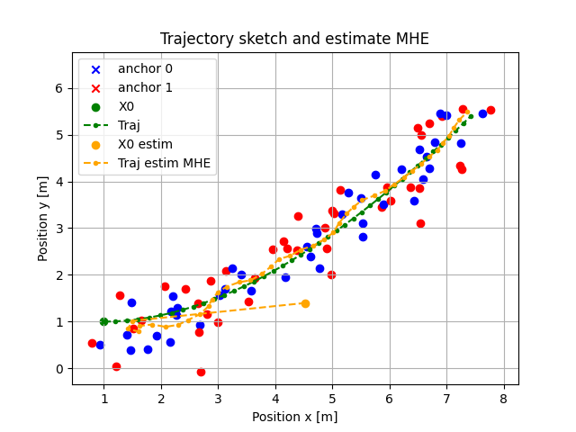

# Localization-of-a-Differential-Drive-Robot-Performance-comparison-of-state-estimators

 
 
 

📝 Description
This project implements and compares four state estimation algorithms for localizing a 2D differential drive robot using range and bearing angle measurements to known landmarks. The goal is to evaluate the accuracy, robustness, and computational efficiency of each estimator in a noisy environment.

📌 Estimators Implemented:
- Extended Kalman Filter (EKF): Linearizes the nonlinear system.
- Unscented Kalman Filter (UKF): Uses sigma points for better nonlinear handling.
- Moving Horizon Estimation (MHE): Optimizes over a sliding window of past measurements.
- Particle Filter (PF): Uses weighted samples to approximate the posterior distribution.

📈 Visualize Results

 </img>
 </img>
 </img>
 </img>

## 🤝 Contributing

Contributions are welcome!

Future improvements could include:
- Monte Carlo simulation
- Sliding mode observer

---

## 📚 References

